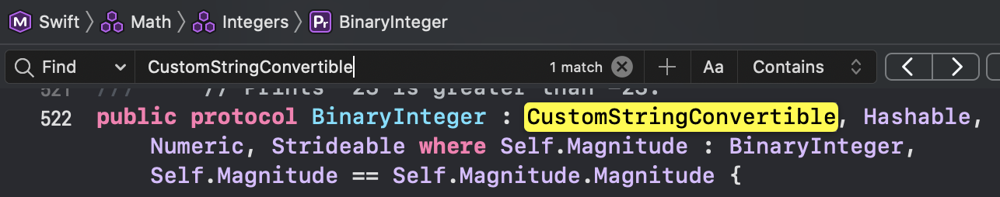
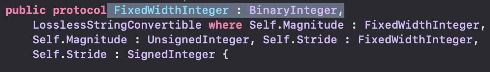
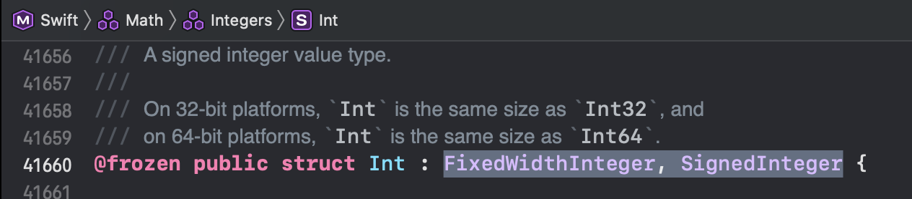

### CustomStringConvertible

---

`LinkedList` 공부를 하다가 `CustomStringConvertible`라는 개념이 나와서 살펴보게 되었다.

애플 공식 문서를 살펴보면 프로토콜인 것을 확인 할 수 있었고, 텍스트적인 표현을 커스터마이즈 하는 타입이라고 설명되어 있다.

프로토콜을 준수하는 타입은 인스턴스를 문자열로 변환할 때 지정해 준 표현으로 제공 할 수 있다.

자세한 건 공식 문서의 예시를 따라 해보며 살펴보자.

```swift
struct Point {
    let x: Int
    let y: Int
}

let p = Point(x: 0, y: 0)
print(p) // Point(x: 0, y: 0)
```

위와 같이 구조체를 선언해 주고 인스턴스를 생성한 뒤 객체를 프린트해보면 주석의 내용과 같다.

```swift
extension Point: CustomStringConvertible {
    var description: String {
        return "좌표는: (\(x), \(y))"
    }
}

let p = Point(x: 0, y: 0)
print(p) // 좌표는: (0, 0)
```

extension을 이용해 `CustomStringConvertible`프로토콜을 채택해 주면 필수 구현 프로퍼티인 `description`프로퍼티를 생성하라고 합니다. 출력하고 싶은 형태를 만들면 위와 같이 원하는 형태로 출력이 가능합니다!

---

여기까지  `CustomStringConvertible`프로토콜에 대해서 알아보았는데 아래 내용은 제가 처음에 살펴볼 때 겪은 내용입니다.

공식 문서 Overview에 `Accessing a type’s description property directly or using CustomStringConvertible as a generic constraint is discouraged.` 이런 문구가 있는데 이 말의 의미가 잘 이해되지 않았습니다. (English So hard!) 

Generic이라는 단어가 들어가 있는 걸 보고 덜컥 겁에 질려 제네릭 타입에는 채택을 하는 것을 권장하지 않는다는 뜻인가 궁금했다.

무튼, 문구의 의미를 정확이 알고 싶어 캠퍼 `소대` 에게 도움을 구했다. (o^-^O)

- 우선 `Accessing a type’s description property directly` 문구부터 보자

타입의 `description` 프로퍼티를 직접 액세스하지 말라는 이야기인데, 앞서 말했듯 `description` 프로퍼티는  `CustomStringConvertible` 프로토콜을 채택하면 필수로 구현해야하는 프로퍼티이다. (`UITableViewDataSource`를 채택하면 `numberOfRowsInSection` 과 `cellForRowAt` 을 꼭 구현해야 하듯이!!)

```swift
print(p) // 좌표는: (0, 0)
print(p.description) // 좌표는: (0, 0)
/* 이렇게 프린팅을 하면 똑같은 문자열이 출력되는데 아래 p.description 같이 직접 접근하지 말라는 의미 같다  */
// 아래와 같이 사용하는 걸 권장한다
let pDescription = String(describing: p)
print(pDescription) // 좌표는: (0, 0)
```

`description`의 공식 문서를 살펴 보면 직접 호출하지 말고 `String(describing:)` 이니셜 라이저를 사용해서 모든 유형의 인스턴스를 문자열로 변환하라고 나와있는데, 정확한 이유는 `String(describing:)`의 공식 문서를 살펴봐야 할 것 같다.! 나중에 공부하고 이유를 알아보기 위해 아래에 링크를 남겨놓겠다.


- `using CustomStringConvertible as a generic constraint is discouraged.`

 우선 이 말의 의미는 제네릭의 제약 조건으로 `CustomStringConvertible`을 사용하는 것을 권장하지 않는다는 말인데

```swift
struct PointGeneric<T> {
    let x: T
    let y: T
}

extension PointGeneric: CustomStringConvertible {
    var description: String {
        return "좌표는: (\(x), \(y))"
    }
}

let pointGeneric = Point(x: 10, y: 10)
let pointGenericDescription = String(describing: pointGeneric)
print(pointGeneric) // 좌표는: (10, 10)
```

위와 같이 사용하면 아무런 문제가 없다 그러나 `제네릭의 제약 조건으로 CustomStringConvertible 을 사용하지 말라는 말`은 아래의 상황처럼 쓰지 말라는것 같다.

우선 제네릭에 제약조건은 `where`키워드를 이용해서 둘 수 있다는것을 알게 되었다.

```swift
struct PointGeneric<T>: CustomStringConvertible where T: CustomStringConvertible {
    var description: String {
        return "좌표는: (\(x), \(y))"
    }
    let x: T
    let y: T
}
let pointGeneric = PointGeneric(x: 10, y: 10)
let pointGenericDescription = String(describing: pointGeneric)
print(pointGenericDescription) // 좌표는: (10, 10)
```

위와 같이 실행하면 정상적으로 코드가 동작한다.

그러나 `zziroType`이라는 타입을 `PointGeneric`에 할당해 주었을때 아래 주석 부분에서 오류가 난다.

```swift
struct zziroType {
    let name: String
}

let pointGeneric = PointGeneric(x: 10, y: 10)
let pointGenericDescription = String(describing: pointGeneric)
print(pointGenericDescription) // 좌표는: (10, 10)

// 이부분
let pointGeneric2 = PointGeneric(x: zziroType(name: "zziro"), y: zziroType(name: "나도 zziro"))
```

`Generic struct 'PointGeneric' requires that 'zziroType' conform to 'CustomStringConvertible'`라는 오류 메세지를 보여주는데 `제네릭 구조체 PointGeneric에서는 zziroType이 CustomStringConvertible을 준수해야합니다.`라는 말이다.

- `Int`, `String`과 같은 `Swift`의 기본 타입들을 할당했을 때는 작동이 되는데 내가 만든 타입을 할당할때는 왜 오류가 날까??


자자.. 그래서 드는 의문이 `Int`라는 타입은 이미 `CustomStringConvertible`프로토콜을 채택하고 있나 궁금해졌습니다.

그래서 `Int`의 Definition으로 Jump 해봤습니다. 그곳에서 `CustomStringConvertible` 키워드를 찾아보니 `BinaryInteger`라는 프로토콜이 채택한 모습을 볼 수 있었어요.



그래서  `BinaryInteger` 프로토콜이  `CustomStringConvertible` 프로토콜 보다 뭔가 더 상위 개념의 프로토콜이라고 생각해서 추적해보았습니다. 추적해보니 상위 프로토콜로 추정되는 `FixedWidthInteger`라는 프로토콜이 채택하고 있더군요. 



한 번 더 추적해보니 `Int`가 `FixedWidthInteger` 프로토콜을 채택한다는 걸 확인해 볼 수 있었습니다.



`Int`라는 타입이 `FixedWidthInteger`를 채택하고, `FixedWidthInteger`이 `BinaryInteger`를 채택하고 `BinaryInteger`이  `CustomStringConvertible`를 채택함으로써 

결국 `Int`라는 타입은  `CustomStringConvertible` 프로토콜을 준수한다는 결론이 나왔습니다.


따라서 제네릭의 제약 조건으로  `CustomStringConvertible`을 사용하는 것을 권장하지 않는 이유는 어느 타입을 받을지 알 수 없는 제네릭의 타입이 `Swift` 기본 타입이 아닌 커스텀 타입을 받게 될 경우에는 예상치 못한 오류를 발생시킬 수 있으므로라고 정리를 해봤다. (정확한 이유 같지는 않지만 나름대로 정리해 보았습니다.)


위의 내용을 권장하지 않는 이유에 대해서는 답을 찾기가 쉽지는 않아 보인다.

글을 보는 분들이 계시다면 의견이나 근거를 제시해 주시면 좋을 것 같다.

---

##### 참고링크

CustomStringConvertible https://developer.apple.com/documentation/swift/customstringconvertible

description https://developer.apple.com/documentation/swift/customstringconvertible/1539130-description

String(describing:) https://developer.apple.com/documentation/swift/string/2427941-init

---

